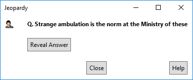
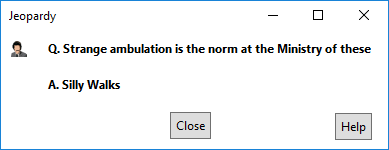
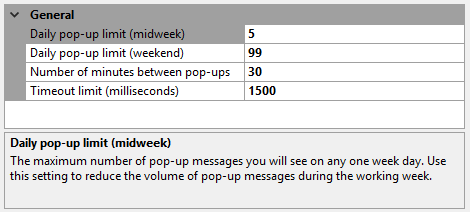

[GitHubRepoURL]: https://github.com/GregTrevellick/TrivialApisForIDE
[GitHubRepoIssuesURL]: https://github.com/GregTrevellick/TrivialApisForIDE/issues
[GitHubRepoPullRequestsURL]: https://github.com/GregTrevellick/TrivialApisForIDE/pulls
[VSMarketplaceUrl]: https://marketplace.visualstudio.com/items?itemName=GregTrevellick.Jeopardy#review-details

A trivial extension that poses a Jeopardy question when opening and/or closing a solution file.

- Simple escapism from the day to day pressures of software development.

- If you like this ***free*** extension, please give it a [review][VSMarketplaceUrl].

- Questions and answers gratefully supplied by free of charge by [jService](http://www.jservice.io).

- Inspired by [Phil Haack's Encourage](https://marketplace.visualstudio.com/items?itemName=Haacked.Encourage) extension. 

- Example question
 
  

- Example answer

   

### Options

- Frequency of pop-up message delivery configurable

- Upper limit of pop-up messages per day configurable, with different values for midweek and weekends

- Configurable timeout (in milliseconds) for third party data retrieval process 

- Ability to request pop-up when opening and/or when closing a solution file

    