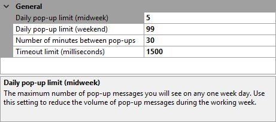

[GitHubRepoURL]: https://github.com/GregTrevellick/TrivialApisForIDE
[GitHubRepoIssuesURL]: https://github.com/GregTrevellick/TrivialApisForIDE/issues
[GitHubRepoPullRequestsURL]: https://github.com/GregTrevellick/TrivialApisForIDE/pulls
[VSMarketplaceUrl]: https://marketplace.visualstudio.com/items?itemName=GregTrevellick.NumericTrivia#review-details

A light-hearted and meaningless extension that asks a Jeopardy trivia question and will reveal the answer when opening a solution file.

- Impress your geek peers or bore your spouse/kids with your new found nerdy numerical knowledge.

- If you like this ***free*** extension, please give it a [review][VSMarketplaceUrl].

- Questions gratefully supplied by [jService](http://www.jservice.io) who offer a free of charge set of services for public consumption on a small Heroku instance (until sufficient demand exists).

- Inspired by [Phil Haack's Encourage](https://marketplace.visualstudio.com/items?itemName=Haacked.Encourage) extension. 

    

### Options

- Frequency of pop-up message delivery configurable

- Upper limit of pop-up messages per day configurable, with different values for midweek and weekends

- Configurable timeout (in milliseconds) for third party data retrieval process 

    